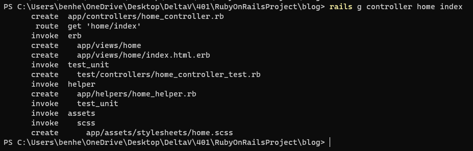
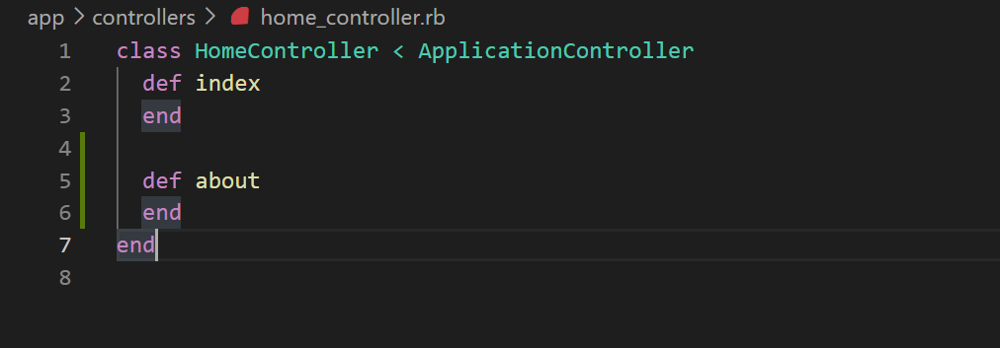
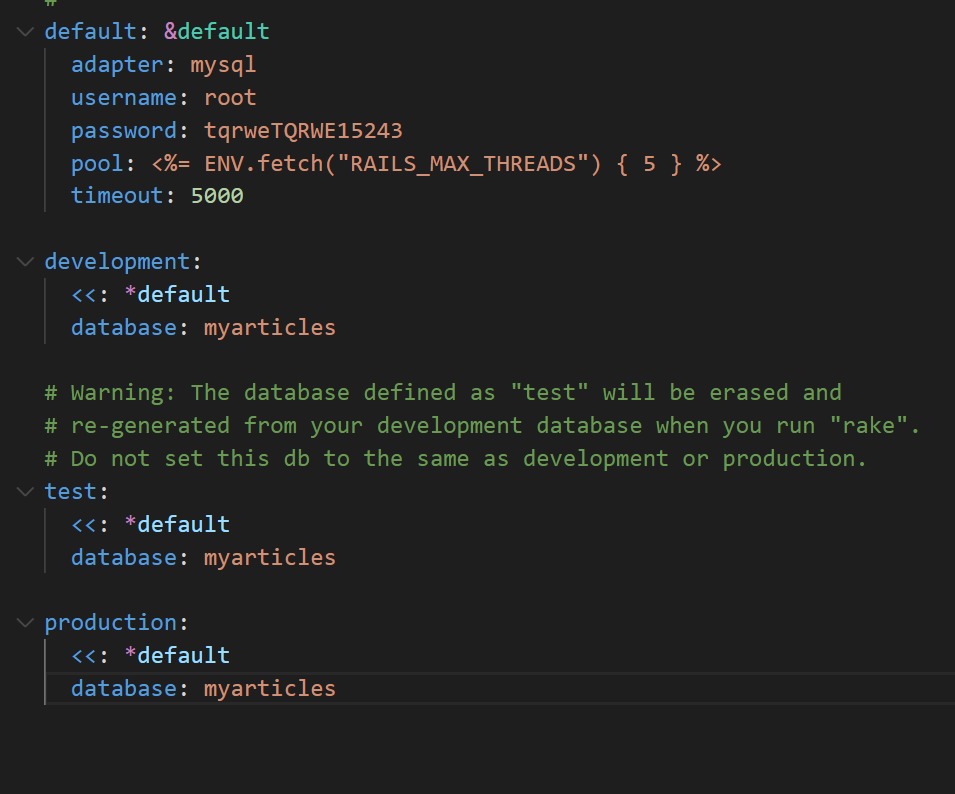
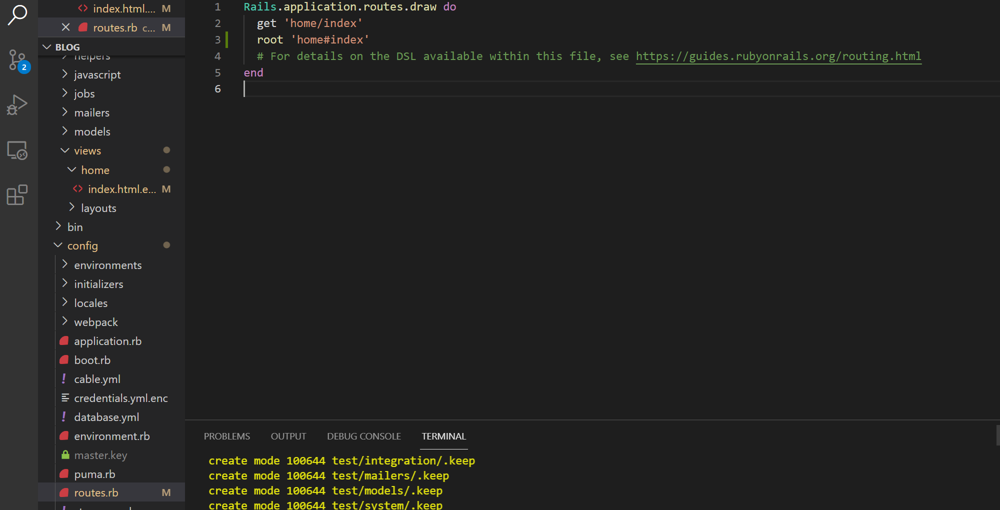
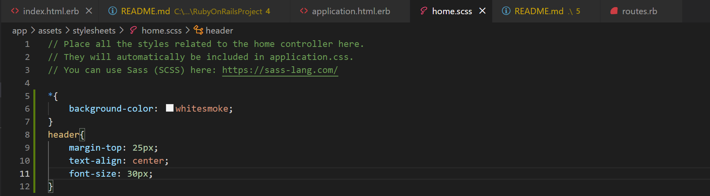

# RubyOnRailsProject

This project was envisioned as something for me to learn the basics of Ruby on Rails and to teach myself something new. 
I am following along with a webpage and a youtube video to develop it. 
[Youtube guide I used](https://www.youtube.com/watch?v=fmyvWz5TUWg)

[Text guide](https://guides.rubyonrails.org/getting_started.html)

ERB stands for embedded ruby

How to use Ruby on Rails  
Well, first you'll need to install Ruby, Rails, Yarn, sometype of database like MySQL, and node. 

Now that that is done you can create a project.  
Creating a new rails project is as simple as typing ```rails new blog```  
You can add extra tags to this to tell Rails what you want to do with the project. You could add --api to the end which tells rails that you will be working with an API and it can leave some stuff out. 

Images!










